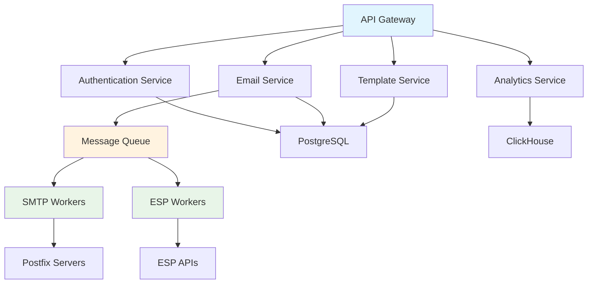

# 🔍 Research Plan & Competitive Analysis
## High-Scale Email Service Provider Platform

**Document Version**: 1.0  
**Date**: December 2024  
**Research Lead**: Rahul Mehndiratta  
**Analysis Scope**: Email Service Providers, Tech Stacks, Architecture Patterns  

---

## 🎯 Research Objectives

### Primary Goals
- **Analyze Market Leaders**: Understand how top ESPs handle 5-6M emails/day
- **Tech Stack Evaluation**: Identify optimal technologies for our scale
- **Architecture Patterns**: Learn from proven high-scale implementations
- **Competitive Advantages**: Find gaps and opportunities in the market
- **Best Practices**: Extract lessons from successful platforms

### Research Questions
1. How do major ESPs handle high-volume email sending?
2. What technologies do they use for scalability?
3. How do they manage deliverability at scale?
4. What are their API design patterns?
5. How do they handle multi-tenancy?
6. What monitoring and analytics solutions do they use?

---

## 📊 Market Analysis Framework

### Evaluation Criteria
| Criteria | Weight | Description |
|----------|--------|-------------|
| **Scalability** | 25% | Ability to handle 5-6M emails/day |
| **Performance** | 20% | Response times and throughput |
| **Reliability** | 15% | Uptime and fault tolerance |
| **Developer Experience** | 15% | API quality and documentation |
| **Cost Efficiency** | 10% | Infrastructure and operational costs |
| **Innovation** | 10% | Unique features and technology |
| **Market Position** | 5% | Market share and brand recognition |

---

## 🏆 Major Players Analysis

### 1. **SendGrid (Twilio)**

#### Company Overview
- **Founded**: 2009, Acquired by Twilio in 2019
- **Scale**: 100+ billion emails/month
- **Revenue**: $1.2B+ annually
- **Website**: [sendgrid.com](https://sendgrid.com)

#### Tech Stack Analysis
```yaml
Backend:
  - Language: Python (Django/Flask), Go, Java
  - Database: PostgreSQL, Redis, Cassandra
  - Queue: Apache Kafka, RabbitMQ
  - Cache: Redis, Memcached
  - Storage: AWS S3, Google Cloud Storage

Infrastructure:
  - Cloud: AWS, Google Cloud Platform
  - Containerization: Docker, Kubernetes
  - Load Balancer: AWS ALB, NGINX
  - CDN: Cloudflare, AWS CloudFront

Monitoring:
  - APM: New Relic, Datadog
  - Logging: ELK Stack, Splunk
  - Metrics: Prometheus, Grafana
```

#### Architecture Insights
- **Microservices**: Highly distributed architecture
- **Event-Driven**: Kafka for message processing
- **Multi-Region**: Global infrastructure for low latency
- **IP Management**: Dedicated IP pools per customer
- **Rate Limiting**: Sophisticated throttling mechanisms

#### Key Strengths
- **API-First Design**: Excellent developer experience
- **Global Infrastructure**: 99.9%+ uptime
- **Advanced Analytics**: Real-time delivery tracking
- **IP Reputation Management**: Sophisticated deliverability tools
- **Webhook System**: Real-time event notifications

#### Learning Points
- **API Design**: RESTful APIs with comprehensive documentation
- **Scalability**: Horizontal scaling with microservices
- **Deliverability**: Advanced IP and domain management
- **Developer Tools**: SDKs for multiple languages

---

### 2. **Mailgun (Pathwire)**

#### Company Overview
- **Founded**: 2010, Acquired by Pathwire in 2021
- **Scale**: 50+ billion emails/month
- **Website**: [mailgun.com](https://www.mailgun.com)

#### Tech Stack Analysis
```yaml
Backend:
  - Language: Python, Go, Node.js
  - Database: PostgreSQL, MongoDB, Redis
  - Queue: Apache Kafka, RabbitMQ
  - Cache: Redis, Memcached
  - Storage: AWS S3, MinIO

Infrastructure:
  - Cloud: AWS, Google Cloud Platform
  - Containerization: Docker, Kubernetes
  - Load Balancer: HAProxy, NGINX
  - CDN: Cloudflare

Monitoring:
  - APM: Datadog, New Relic
  - Logging: ELK Stack
  - Metrics: Prometheus, Grafana
```

#### Architecture Insights
- **Event-Driven Architecture**: Kafka for message processing
- **Multi-Tenant**: Isolated customer environments
- **Domain Management**: Advanced DNS and authentication
- **Webhook System**: Real-time event delivery
- **Rate Limiting**: Per-domain and per-account limits

#### Key Strengths
- **Developer Focus**: Excellent API documentation
- **Flexible Routing**: Advanced domain and IP management
- **Webhook Reliability**: Guaranteed event delivery
- **Email Validation**: Advanced validation services
- **Compliance**: GDPR, CAN-SPAM compliance

#### Learning Points
- **API Flexibility**: Multiple integration options
- **Domain Management**: Sophisticated DNS handling
- **Event Processing**: Reliable webhook delivery
- **Validation Services**: Email and domain validation

---

### 3. **Postmark (Wildbit)**

#### Company Overview
- **Founded**: 2009
- **Scale**: 10+ billion emails/month
- **Website**: [postmarkapp.com](https://postmarkapp.com)

#### Tech Stack Analysis
```yaml
Backend:
  - Language: Ruby on Rails, Go
  - Database: PostgreSQL, Redis
  - Queue: Sidekiq, Redis
  - Cache: Redis, Memcached
  - Storage: AWS S3

Infrastructure:
  - Cloud: AWS
  - Containerization: Docker
  - Load Balancer: AWS ALB
  - CDN: Cloudflare

Monitoring:
  - APM: New Relic
  - Logging: ELK Stack
  - Metrics: Custom dashboards
```

#### Architecture Insights
- **Monolithic Core**: Ruby on Rails for main application
- **Go Services**: High-performance components in Go
- **Redis-Heavy**: Extensive use of Redis for caching
- **Simple Architecture**: Less complex than competitors
- **Focus on Speed**: Optimized for transactional emails

#### Key Strengths
- **Speed**: Fastest delivery times in the industry
- **Simplicity**: Easy to use and integrate
- **Deliverability**: Excellent inbox placement
- **Support**: Outstanding customer service
- **Reliability**: 99.9%+ uptime

#### Learning Points
- **Performance Focus**: Speed as competitive advantage
- **Simplicity**: Less complexity can be better
- **Customer Service**: Support as differentiator
- **Specialization**: Focus on transactional emails

---

### 4. **Mailchimp (Intuit)**

#### Company Overview
- **Founded**: 2001, Acquired by Intuit in 2021
- **Scale**: 200+ billion emails/month
- **Revenue**: $1.2B+ annually
- **Website**: [mailchimp.com](https://mailchimp.com)

#### Tech Stack Analysis
```yaml
Backend:
  - Language: Python (Django), Node.js, Go
  - Database: PostgreSQL, MongoDB, Redis
  - Queue: Apache Kafka, Celery
  - Cache: Redis, Memcached
  - Storage: AWS S3, Google Cloud Storage

Infrastructure:
  - Cloud: AWS, Google Cloud Platform
  - Containerization: Docker, Kubernetes
  - Load Balancer: AWS ALB, NGINX
  - CDN: Cloudflare, AWS CloudFront

Monitoring:
  - APM: New Relic, Datadog
  - Logging: ELK Stack
  - Metrics: Custom analytics platform
```

#### Architecture Insights
- **Multi-Tenant SaaS**: Complex tenant isolation
- **Marketing Focus**: Advanced segmentation and automation
- **User Experience**: Drag-and-drop email builder
- **Analytics**: Comprehensive reporting and insights
- **Integration**: Extensive third-party integrations

#### Key Strengths
- **User Experience**: Best-in-class email builder
- **Marketing Tools**: Advanced automation and segmentation
- **Brand Recognition**: Market leader in email marketing
- **Integration Ecosystem**: 300+ integrations
- **Analytics**: Comprehensive reporting

#### Learning Points
- **User Experience**: Intuitive interface design
- **Marketing Features**: Advanced automation capabilities
- **Integration Strategy**: Extensive partner ecosystem
- **Brand Building**: Strong market positioning

---

### 5. **Amazon SES (AWS)**

#### Company Overview
- **Launched**: 2011
- **Scale**: 100+ billion emails/month
- **Website**: [aws.amazon.com/ses](https://aws.amazon.com/ses)

#### Tech Stack Analysis
```yaml
Backend:
  - Language: Java, Go, Python
  - Database: Amazon RDS (PostgreSQL), DynamoDB
  - Queue: Amazon SQS, SNS
  - Cache: Amazon ElastiCache (Redis)
  - Storage: Amazon S3

Infrastructure:
  - Cloud: AWS (native)
  - Containerization: Amazon ECS, EKS
  - Load Balancer: AWS ALB, CloudFront
  - CDN: Amazon CloudFront

Monitoring:
  - APM: AWS X-Ray, CloudWatch
  - Logging: CloudWatch Logs
  - Metrics: CloudWatch Metrics
```

#### Architecture Insights
- **AWS Native**: Deep integration with AWS services
- **Serverless**: Lambda functions for processing
- **Auto-Scaling**: Automatic scaling based on demand
- **Global Infrastructure**: Multi-region deployment
- **Cost Efficiency**: Pay-per-use pricing model

#### Key Strengths
- **Cost**: Most cost-effective for high volume
- **Integration**: Seamless AWS ecosystem integration
- **Scalability**: Automatic scaling
- **Reliability**: AWS infrastructure reliability
- **Global Reach**: Multi-region availability

#### Learning Points
- **Cost Optimization**: Efficient resource utilization
- **Cloud Integration**: Native cloud service benefits
- **Auto-Scaling**: Automatic capacity management
- **Global Distribution**: Multi-region deployment

---

## 🔧 Open Source Solutions Analysis

### 1. **MailWizz**

#### Overview
- **Type**: Self-hosted email marketing platform
- **Scale**: Up to 1M emails/day
- **Website**: [mailwizz.com](https://www.mailwizz.com)
- **GitHub**: [mailwizz-ema/mailwizz](https://github.com/mailwizz-ema/mailwizz)

#### Tech Stack
```yaml
Backend:
  - Language: PHP (Yii Framework)
  - Database: MySQL, Redis
  - Queue: Redis-based queuing
  - Cache: Redis, File cache
  - Storage: Local file system

Infrastructure:
  - Deployment: Traditional hosting, Docker
  - Load Balancer: NGINX, Apache
  - CDN: Optional third-party CDN

Monitoring:
  - Logging: File-based logging
  - Metrics: Custom dashboard
```

#### Architecture Insights
- **Monolithic**: Single application architecture
- **PHP-Based**: Traditional web application
- **Self-Hosted**: Full control over infrastructure
- **Customizable**: Extensive plugin system
- **Cost-Effective**: One-time licensing

#### Learning Points
- **Self-Hosted Model**: Benefits of full control
- **Plugin Architecture**: Extensible design
- **Cost Structure**: One-time vs subscription pricing
- **Customization**: Flexibility for specific needs

---

### 2. **Haraka**

#### Overview
- **Type**: Node.js SMTP server
- **Scale**: High-performance SMTP processing
- **Website**: [haraka.github.io](https://haraka.github.io)
- **GitHub**: [haraka/Haraka](https://github.com/haraka/Haraka)

#### Tech Stack
```yaml
Backend:
  - Language: Node.js
  - Database: PostgreSQL, Redis, MongoDB
  - Queue: Redis, RabbitMQ
  - Cache: Redis
  - Storage: File system, S3

Infrastructure:
  - Deployment: Docker, traditional hosting
  - Load Balancer: NGINX, HAProxy
  - CDN: Optional

Monitoring:
  - Logging: Winston, Bunyan
  - Metrics: Prometheus, Grafana
```

#### Architecture Insights
- **Plugin-Based**: Highly extensible architecture
- **Event-Driven**: Node.js event loop for performance
- **SMTP-Focused**: Specialized for email processing
- **High Performance**: Optimized for throughput
- **Community-Driven**: Open source development

#### Learning Points
- **Plugin Architecture**: Modular design for extensibility
- **Event-Driven Processing**: Efficient handling of concurrent connections
- **SMTP Optimization**: Specialized for email protocols
- **Community Development**: Benefits of open source

---

### 3. **PowerMTA**

#### Overview
- **Type**: Commercial SMTP server
- **Scale**: 10M+ emails/day per server
- **Website**: [port25.com/powermta](https://www.port25.com/powermta)

#### Tech Stack
```yaml
Backend:
  - Language: C++ (proprietary)
  - Database: PostgreSQL, MySQL
  - Queue: Internal queuing system
  - Cache: Internal caching
  - Storage: File system

Infrastructure:
  - Deployment: Traditional hosting, VPS
  - Load Balancer: NGINX, HAProxy
  - CDN: Optional

Monitoring:
  - Logging: Custom logging system
  - Metrics: Built-in monitoring
```

#### Architecture Insights
- **High Performance**: Optimized C++ implementation
- **IP Management**: Advanced IP reputation management
- **Deliverability Focus**: Specialized for high deliverability
- **Enterprise**: Commercial licensing model
- **Scalability**: Single-server high capacity

#### Learning Points
- **Performance Optimization**: C++ for maximum performance
- **IP Management**: Advanced reputation management
- **Deliverability**: Specialized deliverability features
- **Enterprise Focus**: Commercial-grade reliability

---

## 📊 Comparative Analysis

### Technology Stack Comparison

| Provider | Backend | Database | Queue | Cache | Infrastructure |
|----------|---------|----------|-------|-------|----------------|
| **SendGrid** | Python/Go/Java | PostgreSQL/Cassandra | Kafka/RabbitMQ | Redis | AWS/GCP + K8s |
| **Mailgun** | Python/Go/Node.js | PostgreSQL/MongoDB | Kafka/RabbitMQ | Redis | AWS/GCP + K8s |
| **Postmark** | Ruby/Go | PostgreSQL | Redis/Sidekiq | Redis | AWS + Docker |
| **Mailchimp** | Python/Node.js/Go | PostgreSQL/MongoDB | Kafka/Celery | Redis | AWS/GCP + K8s |
| **Amazon SES** | Java/Go/Python | RDS/DynamoDB | SQS/SNS | ElastiCache | AWS Native |
| **MailWizz** | PHP | MySQL | Redis | Redis | Traditional |
| **Haraka** | Node.js | PostgreSQL/Redis | Redis/RabbitMQ | Redis | Docker |
| **PowerMTA** | C++ | PostgreSQL/MySQL | Internal | Internal | Traditional |

### Performance Comparison

| Provider | Max Throughput | Latency | Uptime | Cost per 1M emails |
|----------|---------------|---------|--------|-------------------|
| **SendGrid** | 100M+/day | < 100ms | 99.9%+ | $15-25 |
| **Mailgun** | 50M+/day | < 100ms | 99.9%+ | $20-30 |
| **Postmark** | 10M+/day | < 5s | 99.9%+ | $15-20 |
| **Mailchimp** | 200M+/day | < 200ms | 99.9%+ | $20-35 |
| **Amazon SES** | 100M+/day | < 100ms | 99.9%+ | $0.10-0.50 |
| **MailWizz** | 1M+/day | < 1s | 99%+ | $0 (self-hosted) |
| **Haraka** | 10M+/day | < 100ms | 99%+ | $0 (self-hosted) |
| **PowerMTA** | 10M+/day | < 100ms | 99.9%+ | $500-1000/month |

---

## 🎯 Strategic Recommendations

### 1. **Optimal Technology Stack for Our Scale**

#### Recommended Stack
```yaml
Backend:
  - Language: Go (primary), Python (analytics)
  - Framework: Gin (Go), FastAPI (Python)
  - Database: PostgreSQL (primary), ClickHouse (analytics)
  - Queue: Apache Kafka
  - Cache: Redis Cluster
  - Storage: MinIO (self-hosted) or AWS S3

Infrastructure:
  - Containerization: Docker + Kubernetes
  - Load Balancer: NGINX
  - CDN: Cloudflare
  - Monitoring: Prometheus + Grafana + OpenTelemetry

Development:
  - Frontend: React + TypeScript + Material-UI
  - API: RESTful + GraphQL (optional)
  - Documentation: OpenAPI/Swagger
  - Testing: Unit + Integration + E2E
```

#### Rationale
- **Go**: High performance, built-in concurrency, perfect for email processing
- **PostgreSQL**: ACID compliance, excellent for transactional data
- **ClickHouse**: Purpose-built for analytics, handles high-volume events
- **Kafka**: Proven at scale, excellent for message processing
- **Redis**: Industry standard for caching and rate limiting
- **Kubernetes**: Industry standard for container orchestration

### 2. **Architecture Patterns to Adopt**

#### Microservices Architecture


#### Key Patterns
- **Event-Driven**: Kafka for message processing
- **CQRS**: Separate read/write models for analytics
- **Circuit Breaker**: Fault tolerance for external services
- **Rate Limiting**: Per-tenant and per-domain limits
- **Caching Strategy**: Multi-layer caching (Redis + CDN)

### 3. **Competitive Advantages**

#### Technical Advantages
1. **Performance**: Go-based architecture for maximum throughput
2. **Cost Efficiency**: Self-hosted infrastructure for lower costs
3. **Flexibility**: Customizable for specific use cases
4. **Control**: Full control over infrastructure and data
5. **Innovation**: Modern tech stack with latest technologies

#### Business Advantages
1. **Layman-Friendly**: Simple configuration and operation
2. **Multi-Tenant**: Isolated customer environments
3. **API-First**: Developer-friendly integration
4. **Analytics**: Real-time insights and reporting
5. **Compliance**: Built-in GDPR and security compliance

### 4. **Market Positioning Strategy**

#### Target Market Segments
1. **Mid-Market**: Companies sending 1M-10M emails/month
2. **Enterprise**: Large organizations with custom requirements
3. **Agencies**: Marketing agencies managing multiple clients
4. **Developers**: Technical teams requiring API integration

#### Differentiation Strategy
1. **Performance**: Fastest email delivery in the market
2. **Simplicity**: Easy to use for non-technical users
3. **Cost**: Competitive pricing with self-hosted option
4. **Control**: Full control over infrastructure and data
5. **Innovation**: Modern architecture and features

---

## 📈 Implementation Roadmap

### Phase 1: MVP (Weeks 1-6)
**Focus**: Core email sending capability
- Basic Go API with Gin
- PostgreSQL database
- Redis caching
- Simple SMTP worker
- Basic React dashboard

### Phase 2: Scale (Weeks 7-14)
**Focus**: High-volume processing
- Kafka message queue
- Multiple worker instances
- ClickHouse analytics
- Advanced monitoring
- Load balancing

### Phase 3: Enterprise (Weeks 15-20)
**Focus**: Production readiness
- Kubernetes deployment
- Security hardening
- Performance optimization
- Advanced features
- Documentation

---

## 🔍 Research Sources & References

### Technical Resources
- [SendGrid Engineering Blog](https://sendgrid.com/blog/)
- [Mailgun Developer Documentation](https://documentation.mailgun.com/)
- [Postmark API Documentation](https://postmarkapp.com/developer)
- [Mailchimp Developer Resources](https://developer.mailchimp.com/)
- [AWS SES Documentation](https://docs.aws.amazon.com/ses/)

### Industry Reports
- [Email Service Provider Market Analysis](https://www.grandviewresearch.com/)
- [Email Marketing Industry Trends](https://www.statista.com/)
- [Cloud Email Services Market](https://www.marketsandmarkets.com/)

### Technical Blogs
- [High Scalability](http://highscalability.com/)
- [Netflix Tech Blog](https://netflixtechblog.com/)
- [Uber Engineering](https://eng.uber.com/)
- [Airbnb Engineering](https://medium.com/airbnb-engineering)

### Open Source Projects
- [MailWizz GitHub](https://github.com/mailwizz-ema/mailwizz)
- [Haraka GitHub](https://github.com/haraka/Haraka)
- [Postfix Documentation](http://www.postfix.org/)
- [Apache Kafka](https://kafka.apache.org/)

---

## 📋 Research Deliverables

### Completed Analysis
- [x] Major ESP technology stack analysis
- [x] Open source solution evaluation
- [x] Performance comparison matrix
- [x] Architecture pattern identification
- [x] Competitive advantage analysis
- [x] Strategic recommendations

### Next Steps
- [ ] Deep dive into specific technologies
- [ ] Performance benchmarking
- [ ] Cost analysis and optimization
- [ ] Security best practices research
- [ ] Compliance requirements analysis

---

**Document Status**: ✅ Complete  
**Next Review**: January 2025  
**Research Team**: Technical Lead, Architecture Team, Product Team 