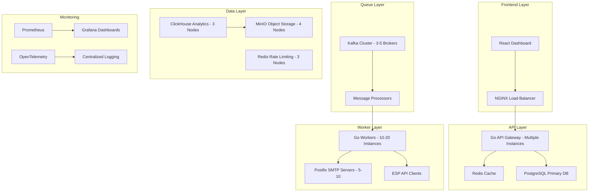

# 🔧 Technical Requirements Document (TRD)
## High-Scale Email Service Provider Platform

**Document Version**: 1.0  
**Date**: December 2024  
**Technical Lead**: Rahul Mehndiratta  
**Architecture Team**: Backend Engineers, DevOps, Security  

---

## 🎯 Technical Vision & Objectives

### Primary Technical Goals
- **Scalability**: Handle 5-6M emails/day with linear scaling
- **Performance**: Sub-100ms API responses, sub-5s email delivery
- **Reliability**: 99.9% uptime with fault tolerance
- **Simplicity**: Layman-friendly configuration and operation
- **Security**: Enterprise-grade security and compliance

### Technical Constraints
- **Language**: Go (Gin/Fiber) for backend services
- **Frontend**: React with TypeScript
- **Database**: PostgreSQL (primary), ClickHouse (analytics)
- **Queue**: Apache Kafka for message processing
- **Cache**: Redis for session and rate limiting
- **Infrastructure**: Kubernetes for orchestration

---

## 🏗️ System Architecture

### High-Level Architecture



### Component Specifications

| Component | Technology | Instances | Resources | Purpose |
|-----------|------------|-----------|-----------|---------|
| **API Gateway** | Go + Gin | 3-5 | 2 CPU, 4GB RAM each | Request handling, authentication, rate limiting |
| **Message Queue** | Apache Kafka | 3-5 brokers | 4 CPU, 8GB RAM each | High-throughput message processing |
| **Sending Workers** | Go | 10-20 | 4 CPU, 8GB RAM each | Email delivery, SMTP/ESP communication |
| **SMTP Servers** | Postfix | 5-10 | 2 CPU, 4GB RAM each | Direct SMTP sending, IP management |
| **Primary DB** | PostgreSQL | 1 master + 2 replicas | 8 CPU, 16GB RAM each | User data, campaigns, configurations |
| **Analytics DB** | ClickHouse | 3 nodes | 8 CPU, 32GB RAM each | Event analytics, reporting data |
| **Cache** | Redis | 3 nodes | 4 CPU, 8GB RAM each | Session, rate limiting, temporary data |
| **Object Storage** | MinIO | 4 nodes | 4 CPU, 16GB RAM each | Templates, attachments, exports |

---

## 🔧 Technology Stack

### Backend Services

#### 1. API Framework: Go with Gin
- **Version**: Go 1.21+
- **Framework**: Gin v1.9+
- **Features**:
  - High-performance HTTP router
  - Built-in middleware support
  - JSON binding and validation
  - CORS handling
  - Rate limiting middleware
  - Graceful shutdown

#### 2. Message Queue: Apache Kafka
- **Version**: 3.5+
- **Configuration**:
  - 3-5 broker cluster
  - Replication factor: 3
  - Partitions: 24 per topic
  - Retention: 7 days
  - Compression: LZ4
- **Topics**:
  - `email.send` - Email sending jobs
  - `email.events` - Email events (sent, delivered, bounced)
  - `analytics.events` - Analytics events
  - `webhooks` - Webhook notifications

#### 3. Database Layer

**Primary Database: PostgreSQL 15+**
- **Configuration**:
  - Master + 2 read replicas
  - Connection pooling (PgBouncer)
  - Automated backups (daily)
  - Point-in-time recovery
- **Extensions**:
  - `pg_stat_statements` - Query monitoring
  - `pg_partman` - Partitioning
  - `pgcrypto` - Encryption
  - `uuid-ossp` - UUID generation

**Analytics Database: ClickHouse 23+**
- **Configuration**:
  - 3-node cluster
  - ReplicatedMergeTree engine
  - Compression: LZ4
  - TTL: 90 days for raw events
- **Tables**:
  - `email_events` - All email events
  - `campaign_metrics` - Aggregated campaign data
  - `deliverability_metrics` - Domain/IP performance

#### 4. Caching: Redis 7+
- **Configuration**:
  - 3-node cluster (master-slave)
  - Persistence: RDB + AOF
  - Memory: 8GB per node
  - Eviction policy: allkeys-lru
- **Use Cases**:
  - Session storage
  - Rate limiting tokens
  - Template caching
  - Temporary data storage

### Frontend Application

#### React Dashboard
- **Framework**: React 18+ with TypeScript
- **State Management**: Redux Toolkit
- **UI Library**: Material-UI v5+
- **Charts**: Recharts or Chart.js
- **Real-time**: WebSocket connections
- **Build Tool**: Vite
- **Deployment**: Static files served via NGINX

### Infrastructure & DevOps

#### Container Orchestration: Kubernetes
- **Version**: 1.28+
- **Cluster**: Multi-zone, auto-scaling
- **Ingress**: NGINX Ingress Controller
- **Service Mesh**: Istio (optional)
- **Monitoring**: Prometheus + Grafana
- **Logging**: ELK Stack or Loki

#### Load Balancer: NGINX
- **Version**: 1.24+
- **Configuration**:
  - SSL termination
  - Rate limiting
  - Gzip compression
  - Health checks
  - Load balancing (round-robin)

---

## 📊 Data Models & Schema

### Core Database Schema

#### Users & Authentication
```sql
-- Users table
CREATE TABLE users (
    id UUID PRIMARY KEY DEFAULT gen_random_uuid(),
    tenant_id UUID NOT NULL REFERENCES tenants(id),
    email VARCHAR(255) UNIQUE NOT NULL,
    password_hash VARCHAR(255) NOT NULL,
    first_name VARCHAR(100),
    last_name VARCHAR(100),
    role user_role NOT NULL DEFAULT 'user',
    status user_status NOT NULL DEFAULT 'active',
    created_at TIMESTAMP DEFAULT NOW(),
    updated_at TIMESTAMP DEFAULT NOW()
);

-- API Keys table
CREATE TABLE api_keys (
    id UUID PRIMARY KEY DEFAULT gen_random_uuid(),
    user_id UUID NOT NULL REFERENCES users(id),
    name VARCHAR(100) NOT NULL,
    key_hash VARCHAR(255) UNIQUE NOT NULL,
    permissions JSONB,
    expires_at TIMESTAMP,
    created_at TIMESTAMP DEFAULT NOW()
);
```

#### Multi-tenancy
```sql
-- Tenants table
CREATE TABLE tenants (
    id UUID PRIMARY KEY DEFAULT gen_random_uuid(),
    name VARCHAR(255) NOT NULL,
    domain VARCHAR(255) UNIQUE,
    plan tenant_plan NOT NULL DEFAULT 'starter',
    status tenant_status NOT NULL DEFAULT 'active',
    settings JSONB DEFAULT '{}',
    created_at TIMESTAMP DEFAULT NOW(),
    updated_at TIMESTAMP DEFAULT NOW()
);
```

#### Email Campaigns
```sql
-- Campaigns table
CREATE TABLE campaigns (
    id UUID PRIMARY KEY DEFAULT gen_random_uuid(),
    tenant_id UUID NOT NULL REFERENCES tenants(id),
    name VARCHAR(255) NOT NULL,
    subject VARCHAR(255),
    template_id UUID REFERENCES templates(id),
    list_id UUID REFERENCES lists(id),
    status campaign_status NOT NULL DEFAULT 'draft',
    scheduled_at TIMESTAMP,
    sent_at TIMESTAMP,
    created_at TIMESTAMP DEFAULT NOW(),
    updated_at TIMESTAMP DEFAULT NOW()
);

-- Campaign metrics
CREATE TABLE campaign_metrics (
    id UUID PRIMARY KEY DEFAULT gen_random_uuid(),
    campaign_id UUID NOT NULL REFERENCES campaigns(id),
    sent_count INTEGER DEFAULT 0,
    delivered_count INTEGER DEFAULT 0,
    opened_count INTEGER DEFAULT 0,
    clicked_count INTEGER DEFAULT 0,
    bounced_count INTEGER DEFAULT 0,
    complained_count INTEGER DEFAULT 0,
    unsubscribed_count INTEGER DEFAULT 0,
    created_at TIMESTAMP DEFAULT NOW(),
    updated_at TIMESTAMP DEFAULT NOW()
);
```

#### Email Lists & Contacts
```sql
-- Lists table
CREATE TABLE lists (
    id UUID PRIMARY KEY DEFAULT gen_random_uuid(),
    tenant_id UUID NOT NULL REFERENCES tenants(id),
    name VARCHAR(255) NOT NULL,
    description TEXT,
    status list_status NOT NULL DEFAULT 'active',
    created_at TIMESTAMP DEFAULT NOW(),
    updated_at TIMESTAMP DEFAULT NOW()
);

-- Contacts table
CREATE TABLE contacts (
    id UUID PRIMARY KEY DEFAULT gen_random_uuid(),
    list_id UUID NOT NULL REFERENCES lists(id),
    email VARCHAR(255) NOT NULL,
    first_name VARCHAR(100),
    last_name VARCHAR(100),
    attributes JSONB DEFAULT '{}',
    status contact_status NOT NULL DEFAULT 'subscribed',
    subscribed_at TIMESTAMP DEFAULT NOW(),
    unsubscribed_at TIMESTAMP,
    created_at TIMESTAMP DEFAULT NOW(),
    updated_at TIMESTAMP DEFAULT NOW()
);
```

#### Email Templates
```sql
-- Templates table
CREATE TABLE templates (
    id UUID PRIMARY KEY DEFAULT gen_random_uuid(),
    tenant_id UUID NOT NULL REFERENCES tenants(id),
    name VARCHAR(255) NOT NULL,
    subject VARCHAR(255),
    html_content TEXT,
    text_content TEXT,
    variables JSONB DEFAULT '[]',
    category VARCHAR(100),
    version INTEGER DEFAULT 1,
    is_active BOOLEAN DEFAULT true,
    created_at TIMESTAMP DEFAULT NOW(),
    updated_at TIMESTAMP DEFAULT NOW()
);
```

### Analytics Schema (ClickHouse)

#### Email Events
```sql
-- Email events table
CREATE TABLE email_events (
    id UUID,
    tenant_id UUID,
    campaign_id UUID,
    contact_id UUID,
    message_id UUID,
    event_type Enum8('sent', 'delivered', 'opened', 'clicked', 'bounced', 'complained', 'unsubscribed'),
    event_data JSON,
    ip_address IPv4,
    user_agent String,
    timestamp DateTime64(3),
    created_at DateTime64(3) DEFAULT now64()
) ENGINE = ReplicatedMergeTree('/clickhouse/tables/{shard}/email_events', '{replica}')
PARTITION BY toYYYYMM(timestamp)
ORDER BY (tenant_id, timestamp, event_type);
```

---

## 🔌 API Specifications

### REST API Endpoints

#### Authentication
```http
POST /v1/auth/login
POST /v1/auth/logout
POST /v1/auth/refresh
POST /v1/auth/forgot-password
POST /v1/auth/reset-password
```

#### Email Sending
```http
POST /v1/send
POST /v1/send/bulk
POST /v1/send/template
GET /v1/send/status/{message_id}
```

#### Campaigns
```http
GET /v1/campaigns
POST /v1/campaigns
GET /v1/campaigns/{id}
PUT /v1/campaigns/{id}
DELETE /v1/campaigns/{id}
POST /v1/campaigns/{id}/send
GET /v1/campaigns/{id}/metrics
```

#### Lists & Contacts
```http
GET /v1/lists
POST /v1/lists
GET /v1/lists/{id}
PUT /v1/lists/{id}
DELETE /v1/lists/{id}
POST /v1/lists/{id}/contacts
GET /v1/lists/{id}/contacts
POST /v1/lists/{id}/import
```

#### Templates
```http
GET /v1/templates
POST /v1/templates
GET /v1/templates/{id}
PUT /v1/templates/{id}
DELETE /v1/templates/{id}
POST /v1/templates/{id}/preview
```

#### Analytics
```http
GET /v1/analytics/overview
GET /v1/analytics/campaigns
GET /v1/analytics/deliverability
GET /v1/analytics/geographic
GET /v1/analytics/export
```

### Webhook Events
```json
{
  "event": "email.delivered",
  "timestamp": "2024-12-19T10:30:00Z",
  "data": {
    "message_id": "uuid",
    "campaign_id": "uuid",
    "contact_id": "uuid",
    "email": "user@example.com",
    "ip_address": "192.168.1.1",
    "user_agent": "Mozilla/5.0...",
    "delivered_at": "2024-12-19T10:30:00Z"
  }
}
```

---

## 🔒 Security Requirements

### Authentication & Authorization
- **JWT Tokens**: RS256 algorithm, 24-hour expiry
- **API Keys**: HMAC-SHA256, configurable expiry
- **Rate Limiting**: Per user, per IP, per tenant
- **CORS**: Configurable origins per tenant
- **2FA**: TOTP support for admin users

### Data Protection
- **Encryption at Rest**: AES-256 for sensitive data
- **Encryption in Transit**: TLS 1.3 for all communications
- **Key Management**: Cloud KMS or HSM
- **Data Masking**: PII protection in logs
- **Audit Logging**: All actions logged with user context

### Network Security
- **VPC**: Isolated network segments
- **Firewall**: Application-level filtering
- **DDoS Protection**: Cloud-based protection
- **SSL/TLS**: Certificate management
- **IP Allowlisting**: Configurable per tenant

---

## 📈 Performance Requirements

### Scalability Targets
- **Horizontal Scaling**: Linear scaling with worker instances
- **Database Scaling**: Read replicas, connection pooling
- **Cache Scaling**: Redis cluster with sharding
- **Queue Scaling**: Kafka partitions and consumer groups
- **Storage Scaling**: Object storage with CDN

### Performance Benchmarks
- **API Response Time**: < 100ms (95th percentile)
- **Email Processing**: < 5 seconds end-to-end
- **Database Queries**: < 50ms for simple queries
- **Cache Hit Rate**: > 95% for session data
- **Queue Latency**: < 100ms for message processing

### Monitoring & Alerting
- **Application Metrics**: Prometheus + Grafana
- **Infrastructure Metrics**: Node exporter, cAdvisor
- **Business Metrics**: Custom dashboards
- **Alerting**: PagerDuty integration
- **Logging**: Centralized logging with ELK

---

## 🚀 Deployment & DevOps

### Infrastructure as Code
- **Terraform**: Infrastructure provisioning
- **Helm Charts**: Kubernetes deployments
- **Docker**: Container images
- **CI/CD**: GitHub Actions or GitLab CI
- **Environment Management**: Dev, Staging, Production

### Deployment Strategy
- **Blue-Green Deployment**: Zero-downtime updates
- **Canary Releases**: Gradual rollout
- **Rollback Strategy**: Quick rollback capability
- **Database Migrations**: Automated schema updates
- **Configuration Management**: Environment-specific configs

### Monitoring & Observability
- **Application Performance Monitoring**: OpenTelemetry
- **Distributed Tracing**: Jaeger
- **Error Tracking**: Sentry
- **Uptime Monitoring**: Pingdom or similar
- **Security Monitoring**: SIEM integration

---

## 🔧 Development Environment

### Local Development Setup
```bash
# Required tools
- Go 1.21+
- Node.js 18+
- Docker & Docker Compose
- PostgreSQL 15+
- Redis 7+
- Kafka (via Docker)

# Development services
- MinIO for object storage
- ClickHouse for analytics
- Prometheus + Grafana for monitoring
```

### Development Workflow
1. **Feature Branches**: Git flow with feature branches
2. **Code Review**: Pull request reviews required
3. **Testing**: Unit, integration, and e2e tests
4. **Documentation**: API docs, code comments
5. **Security**: SAST/DAST scanning

### Testing Strategy
- **Unit Tests**: 90%+ coverage for business logic
- **Integration Tests**: API endpoint testing
- **Performance Tests**: Load testing with k6
- **Security Tests**: OWASP ZAP scanning
- **E2E Tests**: Playwright for UI testing

---

## 📋 Technical Acceptance Criteria

### MVP Requirements
- [ ] Go API with Gin framework operational
- [ ] PostgreSQL database with basic schema
- [ ] Redis caching for sessions and rate limiting
- [ ] Kafka message queue for email processing
- [ ] Basic SMTP worker with Postfix integration
- [ ] React dashboard with authentication
- [ ] Multi-tenant data isolation
- [ ] Basic email sending via API and SMTP

### Beta Requirements
- [ ] ClickHouse analytics integration
- [ ] Advanced template system
- [ ] List management and segmentation
- [ ] Campaign management system
- [ ] Real-time metrics dashboard
- [ ] Webhook system
- [ ] Advanced rate limiting
- [ ] Email validation and sanitization

### Production Requirements
- [ ] Kubernetes deployment with auto-scaling
- [ ] Monitoring and alerting systems
- [ ] Security compliance (GDPR, SOC 2)
- [ ] Performance optimization
- [ ] Disaster recovery procedures
- [ ] Backup and restore systems
- [ ] API documentation and SDKs
- [ ] Customer support tools

---

## 🔄 Technical Roadmap

### Phase 1: Foundation (4-6 weeks)
- Core Go API development
- Database schema design and implementation
- Basic authentication and authorization
- SMTP worker development
- React dashboard foundation

### Phase 2: Core Features (6-8 weeks)
- Template system implementation
- List management and segmentation
- Campaign management
- Analytics integration
- Advanced email processing

### Phase 3: Production Ready (4-6 weeks)
- Kubernetes deployment
- Monitoring and observability
- Security hardening
- Performance optimization
- Documentation and testing

---

**Document Status**: ✅ Complete  
**Next Review**: January 2025  
**Approval Required**: Technical Lead, Architecture Team, Security Team 