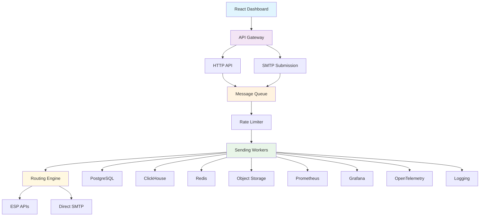
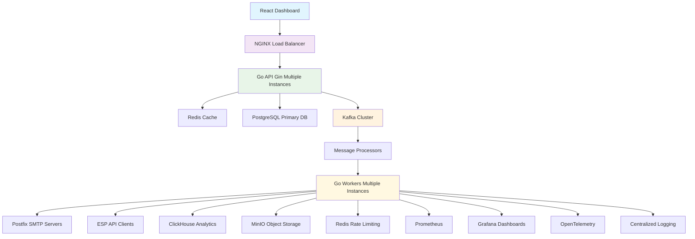

# 🚀 High-Scale Email Sending Platform — Complete Technical Roadmap

> **Goal**: Build a fast, scalable email sending platform capable of **5–6M emails/day** with **multi-threading**, **API + SMTP** ingestion, **flexible port usage**, and **ESP/direct SMTP** routing capabilities.

---

## 📊 System Requirements Analysis

### Performance Targets
- **Daily Volume**: 6,000,000 emails/day
- **Peak Throughput**: 700-1,200 emails/second (10x burst capacity)
- **Concurrency**: 200-1,000 concurrent connections per worker
- **Latency**: < 100ms for API responses, < 5s for email delivery
- **Uptime**: 99.9% availability

### Core Features
- ✅ Multi-threaded sending workers
- ✅ API + SMTP ingestion paths
- ✅ Flexible port configuration (any port)
- ✅ ESP + Direct SMTP routing
- ✅ List management & segmentation
- ✅ Suppression handling
- ✅ Real-time analytics
- ✅ Multi-tenant architecture

---

## 🏗️ Architecture Overview

---

## 🔧 Technology Stack Options

### 1. Backend API Framework

| Option | Pros | Cons | Best For | Resource Links |
|--------|------|------|----------|----------------|
| **Go (Gin/Fiber)** | High performance, built-in concurrency, low memory | Learning curve, smaller ecosystem | High-throughput APIs | [Gin](https://gin-gonic.com/), [Fiber](https://gofiber.io/) |
| **Node.js (Fastify)** | Fast, familiar, rich ecosystem | Single-threaded, memory overhead | Rapid development | [Fastify](https://www.fastify.io/) |
| **Rust (Actix/Axum)** | Maximum performance, memory safety | Steep learning curve | Performance-critical systems | [Actix](https://actix.rs/), [Axum](https://github.com/tokio-rs/axum) |
| **Java (Spring Boot)** | Enterprise-grade, mature ecosystem | Higher resource usage | Enterprise environments | [Spring Boot](https://spring.io/projects/spring-boot) |
| **Python (FastAPI)** | Easy to learn, async support | GIL limitations, slower than Go/Rust | Prototyping, ML integration | [FastAPI](https://fastapi.tiangolo.com/) |
| **C# (.NET)** | High performance, good tooling | Windows-centric, licensing | Windows environments | [.NET](https://dotnet.microsoft.com/) |

**🏆 Recommended**: **Go with Gin** - Best balance of performance, simplicity, and concurrency for email sending workloads.

## 🎯 **Why Go is Perfect for Layman-Friendly Development**

### **Advanced but Simple Language Choice:**

**Fast Performance:**
- **Compiled Language**: Near C/C++ speed for high-throughput email sending
- **Low Memory Usage**: Efficient resource utilization for 5-6M emails/day
- **Network Performance**: Excellent for SMTP/HTTP handling

**Easy to Learn & Understand:**
- **Simple Syntax**: No complex syntax like C++ or Java
- **Clear Error Messages**: Helpful debugging for layman developers
- **Automatic Memory Management**: No manual memory allocation needed
- **Strong Standard Library**: Less external dependencies to manage

**Built-in Concurrency (Perfect for Email Sending):**
- **Goroutines**: Simple multi-threading without complex thread management
- **Channels**: Easy communication between email workers
- **Concurrent SMTP**: Handle thousands of email sends simultaneously

**Layman-Friendly Features:**
- **Fast Compilation**: Quick feedback during development
- **Cross-Platform**: Works on Windows, Linux, macOS
- **Single Binary**: Easy deployment, no runtime dependencies
- **Excellent Documentation**: Built-in documentation system
- **Rich Ecosystem**: Many libraries for email, web, databases

**Perfect for Your Requirements:**
- **5-6M emails/day**: Go can easily handle this scale
- **Multi-threading**: Built-in concurrency for email workers
- **API + SMTP**: Excellent libraries for both
- **Flexible ports**: Easy to configure any port
- **Simple configuration**: Easy for layman to understand and modify

### 2. Message Queue System

| Option | Pros | Cons | Best For | Resource Links |
|--------|------|------|----------|----------------|
| **Apache Kafka** | High throughput, fault tolerance, partitioning | Complex setup, resource intensive | Large-scale production | [Kafka](https://kafka.apache.org/) |
| **NATS JetStream** | Simple setup, lightweight, good performance | Less mature than Kafka | Medium-scale deployments | [NATS](https://nats.io/) |
| **RabbitMQ** | Mature, feature-rich, good management UI | Lower throughput than Kafka | Traditional messaging | [RabbitMQ](https://www.rabbitmq.com/) |
| **Redis Streams** | Simple, fast, integrated with caching | Limited partitioning, persistence | Simple deployments | [Redis Streams](https://redis.io/docs/data-types/streams/) |
| **Apache Pulsar** | High throughput, multi-tenancy, geo-replication | Complex, newer technology | Multi-tenant platforms | [Pulsar](https://pulsar.apache.org/) |
| **Amazon SQS** | Managed, auto-scaling, pay-per-use | Vendor lock-in, higher cost | AWS environments | [SQS](https://aws.amazon.com/sqs/) |

**🏆 Recommended**: **Apache Kafka** - Proven at scale, excellent partitioning for email workloads.

### 3. Primary Database (Control Data)

| Option | Pros | Cons | Best For | Resource Links |
|--------|------|------|----------|----------------|
| **PostgreSQL** | ACID compliance, rich features, JSON support | Complex replication setup | Most use cases | [PostgreSQL](https://www.postgresql.org/) |
| **MySQL 8.0** | Widely used, good performance | Limited JSON features | Traditional applications | [MySQL](https://www.mysql.com/) |
| **CockroachDB** | Distributed, ACID, PostgreSQL compatible | Newer, smaller ecosystem | Distributed deployments | [CockroachDB](https://www.cockroachlabs.com/) |
| **YugabyteDB** | PostgreSQL compatible, distributed | Newer technology | Cloud-native deployments | [YugabyteDB](https://www.yugabyte.com/) |
| **Amazon RDS** | Managed, auto-scaling, backups | Vendor lock-in, cost | AWS environments | [RDS](https://aws.amazon.com/rds/) |
| **Google Cloud SQL** | Managed, global availability | Vendor lock-in | GCP environments | [Cloud SQL](https://cloud.google.com/sql) |

**🏆 Recommended**: **PostgreSQL** - Industry standard, excellent for email platform data models.

### 4. Analytics Database (Events)

| Option | Pros | Cons | Best For | Resource Links |
|--------|------|------|----------|----------------|
| **ClickHouse** | Extremely fast, columnar, high compression | Complex setup, limited ecosystem | High-volume analytics | [ClickHouse](https://clickhouse.com/) |
| **Apache Druid** | Real-time analytics, time-series optimized | Complex, resource intensive | Time-series data | [Druid](https://druid.apache.org/) |
| **TimescaleDB** | PostgreSQL extension, time-series | Limited compared to specialized DBs | PostgreSQL shops | [TimescaleDB](https://www.timescale.com/) |
| **InfluxDB** | Time-series native, good ecosystem | Limited SQL support | IoT-style metrics | [InfluxDB](https://www.influxdata.com/) |
| **Amazon Redshift** | Managed, SQL, good integration | Vendor lock-in, cost | AWS environments | [Redshift](https://aws.amazon.com/redshift/) |
| **Google BigQuery** | Serverless, petabyte scale | Vendor lock-in, cost | GCP environments | [BigQuery](https://cloud.google.com/bigquery) |

**🏆 Recommended**: **ClickHouse** - Purpose-built for high-volume event analytics.

### 5. Caching & Session Store

| Option | Pros | Cons | Best For | Resource Links |
|--------|------|------|----------|----------------|
| **Redis** | Fast, rich data structures, persistence | Memory intensive | Most use cases | [Redis](https://redis.io/) |
| **Memcached** | Simple, lightweight | Limited data structures | Simple caching | [Memcached](https://memcached.org/) |
| **Hazelcast** | Distributed, in-memory computing | Complex, Java-based | Enterprise deployments | [Hazelcast](https://hazelcast.com/) |
| **Amazon ElastiCache** | Managed Redis/Memcached | Vendor lock-in, cost | AWS environments | [ElastiCache](https://aws.amazon.com/elasticache/) |
| **Google Cloud Memorystore** | Managed Redis | Vendor lock-in | GCP environments | [Memorystore](https://cloud.google.com/memorystore) |
| **Azure Cache for Redis** | Managed Redis | Vendor lock-in | Azure environments | [Azure Cache](https://azure.microsoft.com/en-us/services/cache/) |

**🏆 Recommended**: **Redis** - Industry standard, excellent for rate limiting and session management.

### 6. Object Storage

| Option | Pros | Cons | Best For | Resource Links |
|--------|------|------|----------|----------------|
| **Amazon S3** | Industry standard, rich ecosystem | Vendor lock-in, cost | AWS environments | [S3](https://aws.amazon.com/s3/) |
| **Google Cloud Storage** | High performance, global | Vendor lock-in | GCP environments | [Cloud Storage](https://cloud.google.com/storage) |
| **Azure Blob Storage** | Good integration, enterprise | Vendor lock-in | Azure environments | [Blob Storage](https://azure.microsoft.com/en-us/services/storage/blobs/) |
| **MinIO** | S3-compatible, self-hosted | Self-managed | On-premise deployments | [MinIO](https://min.io/) |
| **Ceph** | Open source, distributed | Complex setup | Large-scale on-premise | [Ceph](https://ceph.io/) |
| **Backblaze B2** | Cost-effective, S3-compatible | Smaller ecosystem | Cost-conscious deployments | [B2](https://www.backblaze.com/b2/) |

**🏆 Recommended**: **MinIO** for self-hosted, **Amazon S3** for cloud deployments.

### 7. SMTP Server (Direct Sending)

| Option | Pros | Cons | Best For | Resource Links |
|--------|------|------|----------|----------------|
| **Postfix** | Mature, reliable, configurable | Complex configuration | Production deployments | [Postfix](http://www.postfix.org/) |
| **Haraka** | Node.js based, plugin architecture | Smaller community | Node.js environments | [Haraka](https://haraka.github.io/) |
| **OpenSMTPD** | Simple, secure, OpenBSD | Limited features | Security-focused deployments | [OpenSMTPD](https://www.opensmtpd.org/) |
| **PowerMTA** | Commercial, high performance | Expensive, proprietary | Enterprise customers | [PowerMTA](https://www.port25.com/powermta/) |
| **Mail-in-a-Box** | All-in-one solution | Less flexible | Simple deployments | [Mail-in-a-Box](https://mailinabox.email/) |
| **Mailu** | Docker-based, modern | Newer, smaller community | Containerized deployments | [Mailu](https://mailu.io/) |

**🏆 Recommended**: **Postfix** - Battle-tested, excellent for high-volume sending.

### 8. Container Orchestration

| Option | Pros | Cons | Best For | Resource Links |
|--------|------|------|----------|----------------|
| **Kubernetes** | Industry standard, rich ecosystem | Complex, steep learning curve | Production deployments | [Kubernetes](https://kubernetes.io/) |
| **Docker Swarm** | Simple, Docker native | Limited features | Simple deployments | [Docker Swarm](https://docs.docker.com/engine/swarm/) |
| **Nomad** | Simple, multi-cloud | Smaller ecosystem | HashiCorp stack | [Nomad](https://www.nomadproject.io/) |
| **Amazon ECS** | Managed, AWS integration | Vendor lock-in | AWS environments | [ECS](https://aws.amazon.com/ecs/) |
| **Google GKE** | Managed Kubernetes | Vendor lock-in | GCP environments | [GKE](https://cloud.google.com/kubernetes-engine) |
| **Azure AKS** | Managed Kubernetes | Vendor lock-in | Azure environments | [AKS](https://azure.microsoft.com/en-us/services/kubernetes-service/) |

**🏆 Recommended**: **Kubernetes** - Industry standard, excellent for scaling email workers.

### 9. Monitoring & Observability

| Option | Pros | Cons | Best For | Resource Links |
|--------|------|------|----------|----------------|
| **Prometheus + Grafana** | Industry standard, rich ecosystem | Complex setup | Production monitoring | [Prometheus](https://prometheus.io/), [Grafana](https://grafana.com/) |
| **Datadog** | Full-stack monitoring, APM | Expensive, vendor lock-in | Enterprise environments | [Datadog](https://www.datadoghq.com/) |
| **New Relic** | APM, error tracking | Expensive, vendor lock-in | Application monitoring | [New Relic](https://newrelic.com/) |
| **Elastic Stack** | Logs, metrics, search | Resource intensive | Log analysis | [Elastic](https://www.elastic.co/) |
| **Jaeger** | Distributed tracing | Limited metrics | Tracing only | [Jaeger](https://www.jaegertracing.io/) |
| **Zabbix** | Traditional monitoring | Less modern | Legacy environments | [Zabbix](https://www.zabbix.com/) |

**🏆 Recommended**: **Prometheus + Grafana** - Open source, excellent for email platform metrics.

### 10. Load Balancer

| Option | Pros | Cons | Best For | Resource Links |
|--------|------|------|----------|----------------|
| **NGINX** | Fast, configurable, reverse proxy | Complex configuration | Most deployments | [NGINX](https://nginx.org/) |
| **HAProxy** | High performance, health checks | Complex configuration | High-performance needs | [HAProxy](https://www.haproxy.org/) |
| **Traefik** | Auto-discovery, modern | Newer, smaller ecosystem | Container environments | [Traefik](https://traefik.io/) |
| **Envoy** | Modern, service mesh ready | Complex, resource intensive | Service mesh deployments | [Envoy](https://www.envoyproxy.io/) |
| **AWS ALB** | Managed, auto-scaling | Vendor lock-in, cost | AWS environments | [ALB](https://aws.amazon.com/elasticloadbalancing/) |
| **Cloudflare** | Global CDN, DDoS protection | Vendor lock-in | Global deployments | [Cloudflare](https://www.cloudflare.com/) |

**🏆 Recommended**: **NGINX** - Battle-tested, excellent for email API load balancing.

---

## 🏗️ Recommended Architecture Stack

Based on your requirements for **5-6M emails/day**, here's the optimal stack:

### Component Specifications

| Component | Technology | Instances | Resources |
|-----------|------------|-----------|-----------|
| **API Gateway** | Go + Gin | 3-5 | 2 CPU, 4GB RAM each |
| **Message Queue** | Apache Kafka | 3-5 brokers | 4 CPU, 8GB RAM each |
| **Sending Workers** | Go | 10-20 | 4 CPU, 8GB RAM each |
| **SMTP Servers** | Postfix | 5-10 | 2 CPU, 4GB RAM each |
| **Primary DB** | PostgreSQL | 1 master + 2 replicas | 8 CPU, 16GB RAM each |
| **Analytics DB** | ClickHouse | 3 nodes | 8 CPU, 32GB RAM each |
| **Cache** | Redis | 3 nodes | 4 CPU, 8GB RAM each |
| **Object Storage** | MinIO | 4 nodes | 4 CPU, 16GB RAM each |

---

## 📋 Implementation Phases

### Phase 1: MVP (4-6 weeks)
- Basic Go API with Gin
- PostgreSQL for data storage
- Redis for caching and rate limiting
- Simple SMTP worker with Postfix
- Basic React dashboard
- Kafka for message queuing

### Phase 2: Scale (6-8 weeks)
- Multiple worker instances
- ClickHouse for analytics
- Advanced routing engine
- ESP integrations (SES, SendGrid, Mailgun)
- Monitoring with Prometheus + Grafana
- Load balancing with NGINX

### Phase 3: Production (4-6 weeks)
- Kubernetes deployment
- Advanced monitoring and alerting
- Multi-region support
- Advanced analytics and reporting
- Security hardening
- Performance optimization

---

## 📚 Existing Email Platform Solutions & Inspiration

### **Major Email Service Providers (ESPs)**

**Ongage**
- **Website**: [ongage.com](https://www.ongage.com/)
- **Key Features**: Multi-channel marketing, advanced segmentation, automation workflows
- **Strengths**: Enterprise-grade, comprehensive analytics, multi-tenant architecture
- **Learning Points**: Study their API design, segmentation engine, and automation features

**Mailchimp**
- **Website**: [mailchimp.com](https://mailchimp.com/)
- **Key Features**: Drag-and-drop editor, audience management, marketing automation
- **Strengths**: User-friendly interface, extensive integrations, robust analytics
- **Learning Points**: Focus on user experience and template management

**SendGrid**
- **Website**: [sendgrid.com](https://sendgrid.com/)
- **Key Features**: Transactional email API, email validation, deliverability tools
- **Strengths**: High deliverability, developer-friendly, excellent documentation
- **Learning Points**: API design patterns and deliverability best practices

**Mailgun**
- **Website**: [mailgun.com](https://www.mailgun.com/)
- **Key Features**: Email API, webhooks, domain management
- **Strengths**: Developer-focused, flexible routing, good documentation
- **Learning Points**: Webhook implementation and domain reputation management

**Postmark**
- **Website**: [postmarkapp.com](https://postmarkapp.com/)
- **Key Features**: Transactional email, high deliverability, detailed logs
- **Strengths**: Excellent deliverability, fast delivery, detailed tracking
- **Learning Points**: Focus on speed and deliverability optimization

### **Open Source Solutions**

**MailWizz**
- **Website**: [mailwizz.com](https://www.mailwizz.com/)
- **Key Features**: Self-hosted email marketing, list management, automation
- **Strengths**: Full control, one-time payment, extensive features
- **Learning Points**: Study their database schema and list management system
- **GitHub**: [mailwizz-ema/mailwizz](https://github.com/mailwizz-ema/mailwizz)

**Interspire Email Marketer**
- **Website**: [interspire.com](https://www.interspire.com/)
- **Key Features**: Email marketing platform, template editor, automation, list management
- **Strengths**: Comprehensive features, good documentation, self-hosted solution
- **Learning Points**: Template system, automation workflows, list segmentation
- **Architecture**: PHP-based, MySQL database, modular design
- **Notable**: One of the first comprehensive email marketing platforms
- **Study Focus**: User interface design, campaign management workflow

**Mautic**
- **Website**: [mautic.org](https://www.mautic.org/)
- **Key Features**: Marketing automation, lead management, email campaigns
- **Strengths**: Open source, marketing automation focus
- **Learning Points**: Marketing automation and lead scoring systems
- **GitHub**: [mautic/mautic](https://github.com/mautic/mautic)

**EmailOctopus**
- **Website**: [emailoctopus.com](https://emailoctopus.com/)
- **Key Features**: Simple email marketing, affordable pricing
- **Strengths**: User-friendly, cost-effective
- **Learning Points**: Simplified user experience design

**eMercury**
- **Website**: [emercury.com](https://www.emercury.com/)
- **Key Features**: Email marketing platform, automation, analytics
- **Strengths**: User-friendly interface, comprehensive features
- **Learning Points**: Simple configuration, layman-friendly design
- **Study Focus**: How to make complex features simple for non-technical users

### **Enterprise Solutions**

**Salesforce Marketing Cloud**
- **Website**: [salesforce.com/marketing-cloud](https://www.salesforce.com/marketing-cloud/)
- **Key Features**: Enterprise marketing automation, AI-powered insights
- **Strengths**: Enterprise integration, advanced analytics, AI features
- **Learning Points**: Enterprise architecture and AI integration

**HubSpot Marketing Hub**
- **Website**: [hubspot.com/marketing](https://www.hubspot.com/marketing)
- **Key Features**: Inbound marketing, automation, CRM integration
- **Strengths**: All-in-one platform, excellent user experience
- **Learning Points**: User experience and CRM integration

**Klaviyo**
- **Website**: [klaviyo.com](https://www.klaviyo.com/)
- **Key Features**: E-commerce focused, behavioral targeting
- **Strengths**: E-commerce integration, behavioral automation
- **Learning Points**: E-commerce specific features and behavioral targeting

### **Technical Solutions to Study**

**PowerMTA**
- **Website**: [port25.com/powermta](https://www.port25.com/powermta/)
- **Key Features**: High-performance SMTP server, IP management
- **Strengths**: High throughput, advanced IP management
- **Learning Points**: SMTP server optimization and IP reputation management

**Haraka**
- **Website**: [haraka.github.io](https://haraka.github.io/)
- **Key Features**: Node.js SMTP server, plugin architecture
- **Strengths**: Extensible, modern architecture
- **Learning Points**: Plugin system and SMTP server design
- **GitHub**: [haraka/Haraka](https://github.com/haraka/Haraka)

**Postfix**
- **Website**: [postfix.org](http://www.postfix.org/)
- **Key Features**: MTA server, high performance, security
- **Strengths**: Battle-tested, secure, high performance
- **Learning Points**: MTA architecture and security best practices

### **Key Learning Areas from These Solutions**

**1. Architecture Patterns**
- Multi-tenant data isolation
- Scalable worker systems
- Message queue implementations
- Database sharding strategies

**2. API Design**
- RESTful API patterns
- Webhook implementations
- Rate limiting strategies
- Authentication mechanisms

**3. User Experience**
- Template editors
- Campaign builders
- Analytics dashboards
- List management interfaces

**4. Deliverability**
- IP reputation management
- Bounce handling
- Complaint processing
- Domain authentication (SPF, DKIM, DMARC)

**5. Performance**
- Caching strategies
- Database optimization
- Load balancing
- Horizontal scaling

### **Recommended Study Order**

1. **Start with MailWizz** - Open source, comprehensive features
2. **Study SendGrid API** - Excellent API design patterns
3. **Analyze Ongage** - Enterprise multi-tenant architecture
4. **Review Haraka** - Modern SMTP server implementation
5. **Examine PowerMTA** - High-performance sending optimization

### **Additional Inspiration Sources**

**Email Infrastructure & Standards**
- **RFC 5321** - SMTP protocol specification
- **RFC 6376** - DKIM authentication
- **RFC 7208** - SPF record specification
- **RFC 7489** - DMARC policy framework

**Open Source Email Projects**
- **Mail-in-a-Box** - [github.com/mail-in-a-box/mailinabox](https://github.com/mail-in-a-box/mailinabox)
- **iRedMail** - [iredmail.org](https://www.iredmail.org/)
- **Mailu** - [github.com/Mailu/Mailu](https://github.com/Mailu/Mailu)

**Email Deliverability Resources**
- **250ok** - [250ok.com](https://250ok.com/) - Deliverability monitoring
- **Mail-Tester** - [mail-tester.com](https://www.mail-tester.com/) - Email testing
- **GlockApps** - [glockapps.com](https://glockapps.com/) - Inbox placement testing

**Community & Forums**
- **EmailGeeks** - [emailgeeks.com](https://emailgeeks.com/) - Email marketing community
- **Stack Overflow** - Email development tags
- **Reddit r/emailmarketing** - Community discussions

---

## 🔗 Key Resources & Documentation

### Learning Resources
- [Email Infrastructure Best Practices](https://www.ietf.org/rfc/rfc5321.txt)
- [SMTP Protocol Guide](https://tools.ietf.org/html/rfc5321)
- [DKIM Implementation](https://tools.ietf.org/html/rfc6376)
- [SPF Record Guide](https://tools.ietf.org/html/rfc7208)
- [DMARC Implementation](https://tools.ietf.org/html/rfc7489)

### Performance Tuning
- [Go Performance Best Practices](https://golang.org/doc/effective_go.html)
- [PostgreSQL Performance Tuning](https://www.postgresql.org/docs/current/performance.html)
- [Kafka Performance Tuning](https://kafka.apache.org/documentation/#performance)
- [Redis Performance Optimization](https://redis.io/topics/optimization)

### Deployment Guides
- [Kubernetes Email Platform Deployment](https://kubernetes.io/docs/concepts/workloads/)
- [Docker Email Services](https://docs.docker.com/get-started/)
- [Monitoring Email Infrastructure](https://prometheus.io/docs/introduction/overview/)

---

## 🎯 Next Steps

1. **Set up development environment** with Go, PostgreSQL, Redis
2. **Create basic API structure** with Gin framework
3. **Implement SMTP worker** with Postfix integration
4. **Build message queue** with Kafka
5. **Create React dashboard** for monitoring
6. **Deploy to Kubernetes** for scaling
7. **Add monitoring** with Prometheus + Grafana
8. **Implement advanced features** (routing, analytics, etc.)

This roadmap provides everything you need to build a high-scale email sending platform capable of handling 5-6M emails per day with proper architecture, technology choices, and implementation phases.
